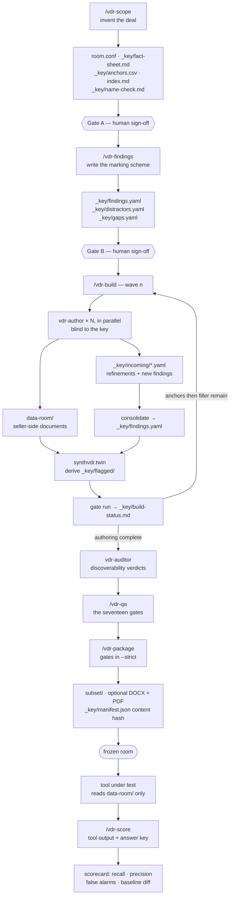

# Architecture

How synth-vdr fits together: the data model, the workflow, the subagents, the Python
package, and the invariants that hold it all in place. For what the project is and who it
is for, see [README.md](README.md); for commands, formats and known limits, see
[TECHNICAL-NOTES.md](TECHNICAL-NOTES.md).

---

## 1. The core idea: two trees and one key

Everything in this project follows from a single decision — **the room a tool is evaluated
against, and the room a human reviews, are two separate trees, and the second is derived
from the first.**

- **The blind tree** (`data-room/`) is the eval input. It is ordinary seller-side
  paperwork. Nothing in it says which document is interesting, and the answer-key
  vocabulary ("planted finding", "distractor", a finding ID) never appears in it.
- **The flagged tree** (`_key/flagged/`) is the same corpus for human eyes. A benign
  document is **byte-identical** to its blind twin; a document carrying evidence is the
  blind file plus **one trailing annotation block** naming the finding.
- **The answer key** (`_key/`) is everything else: the invented facts, the findings
  registry, the distractors, the build status and the release manifest.

Two consequences fall out of this and drive most of the code:

**Blind-first authoring.** The natural document is written first; the annotation is derived
from it afterwards. It is never the other way round, because a document written to justify
a pre-written annotation reads like one — and a tool that can spot "the document that was
written to contain the answer" is not being tested on diligence.

**One writer.** `synthvdr/twin.py` is the *only* thing that writes the flagged tree, and it
rebuilds it in full from the blind tree on every build. Nothing else may write under it —
that is what makes gate 7 ("a blind document and its flagged twin differ only by an
annotation block") a meaningful check rather than a tautology.

---

## 2. A room on disk

```
<room>/
├── room.conf                  the single source of room constants; shell-sourceable
├── index.md                   tool-facing contents list — GENERATED, never hand-edited
├── data-room/                 THE BLIND TREE — what a tool under test is given
│   └── 01_corporate/ … 20_jv-minority-interests/     twenty workstream sections
├── data-room-docx/            optional DOCX render, mirroring the blind tree
├── data-room-pdf/             optional PDF render, mirroring the blind tree
├── subset/                    deterministic bounded cut, every finding intact
│   └── .synthvdr-subset       ownership marker (see §7)
└── _key/                      THE ANSWER KEY — never given to the tool under test
    ├── fact-sheet.md          the invented deal: narrative, cast, invented names,
    │                          canonical figures. Every figure in the room traces here
    ├── findings.yaml          the findings registry — CANONICAL
    ├── findings.md            human-readable render of the above — GENERATED
    ├── distractors.yaml       the red herrings and where each one resolves
    ├── gaps.yaml              deliberately unresolvable cross-references, allowlisted
    ├── name-check.md          the web-search verdict for every invented name
    ├── anchors.csv            the slot manifest: every document slot and its tier
    ├── labels.yaml            each blind document's type, in the downstream classifier's vocabulary
    ├── answer-key.jsonl       GENERATED from labels.yaml + sections.yaml (python3 -m synthvdr answerkey)
    ├── index-src/             the source index.md is regenerated from
    │   └── .synthvdr-index-src    ownership marker
    ├── incoming/              subagent hand-back: refinements and new findings, per wave
    ├── build-status.md        the resume pointer: waves done, next wave to run
    ├── manifest.json          release manifest, including the room's content hash
    ├── adjudications.yaml     recorded LLM judgements from a scoring run
    ├── scanned.csv            optional: PDF pages to render as image-only scans
    └── flagged/               THE FLAGGED TREE — blind twins plus annotations
        └── .synthvdr-flagged-tree ownership marker
```

`room.conf` is deliberately a flat, shell-sourceable `KEY="VALUE"` file, so that whoever
owns a room can read its constants from their own shell without a Python dependency. No
shipped script sources it — `tools/check.sh` takes the room directory as an argument and
execs `python3 -m synthvdr.qa`, reading no config at all — so the format is a guarantee
kept for the room's owner rather than something the toolchain needs. It declares the room codename, the document totals, the
three tree paths, the two annotation flag strings, the finding-ID prefixes, the section
directories and the expected annotation-carrier count. Every path-valued key is validated
against the room root when it is loaded — no key may escape the room, and no component may
be a symlink that redirects.

---

## 3. The workflow



**The two gates are hard stops.** Gate A closes the invented facts and the name-collision
record; Gate B closes the ID space for findings and distractors. Neither is advisory: the
downstream skills refuse to run until the preceding artefacts exist, and `/vdr-build`
authors documents that make an *already signed-off* registry true of the corpus — it never
invents a finding of its own.

**The build loop is the interesting part.** Documents are authored in waves, and within a
wave by several `vdr-author` subagents in parallel. Slots are sorted by tier before
batching: every `A` (anchor — carries a finding, a distractor, or is otherwise
load-bearing) slot is exhausted across as many waves as it takes before a single `F`
(filler) slot is assigned. The corpus is therefore complete and valid at every checkpoint,
and an interrupted build never strands a finding half-planted.

After each wave: authors' hand-backs in `_key/incoming/` are consolidated into the
registry, the flagged tree is re-derived, the gates run, and only an all-PASS gate run
lets `_key/build-status.md` record the wave. Re-running `/vdr-build` reads that file first
and continues from the next wave — it never re-authors a slot a completed wave recorded.

---

## 4. The two subagents, and why both are blind

The discoverability guarantee is the whole point of the project, and it rests entirely on
what these two subagents are *not* told.

**`vdr-author`** ([agents/vdr-author.md](agents/vdr-author.md)) is given its own slot list,
the fact-sheet extracts it needs, and the registry rows for findings whose evidence falls
inside its own batch. It is **not** given the full `_key/findings.yaml`, and it is not given
the flagged tree or even its location. It writes the offending clause as natural
seller-side content, with no analytical overlay, then writes its refinement of that
finding's `location` and `substance` into `_key/incoming/<label>.yaml`.

When an author discovers a genuine issue nobody drafted at Gate B, it declares it — under a
**label-scoped provisional ID** (`<label>-NEW-1`), never a real one. Parallel authors cannot
see each other, so two of them each taking "the next free ENV number" would silently collide
on one ID for two distinct issues. Consolidation, which happens once per wave in one place,
is what assigns the real workstream-numbered ID.

**`vdr-auditor`** ([agents/vdr-auditor.md](agents/vdr-auditor.md)) is given a finding's
**substance** — what the issue is, in the abstract — and the path to the blind room. It is
given **nothing** about where the finding lives: not the source document, not the
corroboration documents, not the location within them, not `_key/findings.yaml`, and not
the flagged tree. It never opens anything under `_key/`, and it is read-only.

That asymmetry is deliberate and load-bearing in both directions. Told the location too, its
verdict would measure whether it can find a paragraph it was just pointed at — trivially
always yes. Told nothing at all, every verdict would be a guess. Told the substance and not
the location, it reaches the finding the way a real reviewer with a diligence checklist
would, and its verdict is what gate 15 records as `discoverable_from_blind`.

---

## 5. The Python package

`synthvdr` does the deterministic, checkable work; the skills and subagents do the
judgement-shaped work. Anything that must be identical across runs lives here.

| Module | Responsibility |
|---|---|
| `roomconf` | Parses `room.conf`, the single source of room constants. Validates every path-valued key against the room root; rejects escapes and redirecting symlinks. Shell-sourceable format, so a room's owner can read its constants from their own shell; no shipped script sources it. Rejects a key set twice rather than taking the last value. |
| `domain` | Domain packs — the section taxonomy, document archetypes and finding seeds, loaded from `domain/ma/`. |
| `slots` | The slot manifest: the deterministic list of document slots, each with a tier (`A` anchor / `F` filler). Holds the size presets — XS 40, S 60, M 200, L 800, XL 2,000 documents. |
| `index_build` | Writes `_key/index-src/` and regenerates `index.md` from it. `index.md` is tool-facing but sits outside the blind tree, and is never hand-edited. |
| `twin` | Derives the flagged tree from the blind tree. The only writer of `_key/flagged/`. |
| `subset` | Selects and builds the deterministic subset — every finding survives with its full evidence chain, filler chosen by hash up to a bound derived from the room's own size. Also reconciles an existing subset (gate 11) without writing. |
| `ownership` | The shared "is this directory ours to delete?" guard, reused by `twin`, `subset` and `index_build` rather than re-derived in each. See §7. |
| `names` | Cast-name masking and corporate-suffix scanning — the primitives behind the unchecked-name sweep. |
| `namecheck` | Extracts candidate invented names from three declared sources and keeps the durable `name-check.md` record. The searching itself happens in `/vdr-scope`, because only the agent has WebSearch. |
| `schema` | The answer-key model — findings and distractors — plus `validate()`'s internal-consistency checks. YAML is canonical; `findings.md` is generated from it. |
| `score` | Deterministic scoring: provenance check, evidence-path prematching, recall/precision/partial trails, adjudication reconciliation, scorecard rendering and baseline diff. |
| `qa/` | The seventeen gates (`structural`, `leakage`, `depth`, `integrity`, `renders`) and the runner that enforces how they report. |
| `render/` | The optional DOCX (`docx.py`) and PDF (`pdf.mjs`, a separate Node process) renders. Never imported at core-build time. |

Two separate CLIs, sharing no conventions beyond their general shape: `python3 -m
synthvdr.qa` runs the gates; `python3 -m synthvdr score` marks a tool's output. The split is
structural rather than chosen — `synthvdr.qa` is a package carrying its own `__main__.py`,
so it never executes `synthvdr/__main__.py`. See [TECHNICAL-NOTES.md](TECHNICAL-NOTES.md) §2.

### Why `names` reads the room backwards

The unchecked-name sweep does not extract candidate names from prose and then ask whether
each is on the cast list — three earlier versions did, and each carried both error classes
at once. The operation is inverted instead: `mask_cast_names` removes every known cast name
from the text **first**, and `entity_tokens` scans only the residue. A registered name is
gone before the regex ever runs, so no number of ordinary leading words can manufacture a
candidate, and whatever the regex still finds carries a corporate suffix that no cast entry
accounts for — which is the definition of unchecked. The false-positive class goes
structurally, with no stoplist and no bound.

---

## 6. The seventeen gates

`python3 -m synthvdr.qa --room <dir>` runs every gate in `synthvdr/qa/__init__.py`'s
`ALL_GATES`. This is the same suite `/vdr-qa` runs after every build wave and
`/vdr-package` runs in `--strict` before release.

| # | Gate | Checks |
|---|---|---|
| 1 | Index count and regeneration | `index.md` matches a fresh regeneration from `_key/index-src/` |
| 2 | Tree counts | Document counts match `room.conf`'s declared totals |
| 3 | Annotation-string leakage | The flag strings never appear in the blind tree |
| 4 | Blind-tree vocabulary sweep | Answer-key vocabulary never appears in the blind tree |
| 5 | Index.md vocabulary sweep | A wider vocabulary sweep of `index.md` itself |
| 6 | Directory canon | Blind and flagged trees mirror the same directory shape |
| 7 | Twin diff | A blind document and its flagged twin differ only by an annotation block |
| 8 | Annotation-carrier census | Every finding's/distractor's evidence path exists, and every markdown evidence path carries its annotation block in the flagged twin |
| 9 | Cross-reference resolution | Every cross-reference in the room resolves to a real slot |
| 10 | Depth lint | Document depth and density are inside the room's declared bounds |
| 11 | Subset reconciliation | `subset/`, if built, reproduces every finding with its full evidence chain |
| 12 | Answer-key containment | Nothing under `_key/` leaks into the blind tree |
| 13 | Fact-sheet reconciliation | Canonical figures in `_key/fact-sheet.md` appear consistently, with no superseded value surviving |
| 14 | Unchecked names | Every entity-shaped token in the room is on the fact-sheet cast list, and no recorded verdict is a collision |
| 15 | Discoverability audit | Every registered finding has a recorded `discoverable_from_blind` verdict |
| 16 | Render parity | DOCX/PDF renders, if built, mirror the blind tree's document set by filename, in both directions |
| 17 | Answer-key validation | `_key/findings.yaml` / `_key/distractors.yaml` pass `synthvdr.schema.validate()`'s internal-consistency checks |

**The runner enforces three disciplines, once, rather than leaving them to each gate.**

1. **A gate whose inputs are absent SKIPs loudly.** Silence is indistinguishable from a
   pass, and in an earlier build that silence hid three renderer defects — one of them
   clipping answer-key evidence out of the PDFs — for two whole phases.
2. **An empty gate list is refused, not reported as a clean pass.** That is the same
   silence-as-pass failure one level up: not one gate skipping quietly, but zero gates ever
   having run.
3. **Every gate's detail prints as exactly one line**, with embedded newlines collapsed, so
   a leak sweep naming several paths cannot break the transcript.

`--strict` turns every SKIP into a hard failure. It is what `/vdr-package` runs, and it is
the only mode that verifies a room end-to-end — the plain mode is a mid-build diagnostic
that legitimately skips gates whose inputs do not exist yet.

Gate caveats — what each gate can and cannot see — are in
[TECHNICAL-NOTES.md](TECHNICAL-NOTES.md) §6.

---

## 7. Invariants

These are the properties everything else assumes. Breaking one is a design change, not a
refactor. The rulings behind them, including options deliberately not taken, are in the
build ledger — kept outside this repository.

**YAML is canonical.** `_key/findings.yaml` and `_key/distractors.yaml` are the answer key;
`_key/findings.md` is generated from them and must never be hand-edited. Nothing else in the
project parses the key.

**The key never reaches the eval input.** Gates 3, 4, 5 and 12 enforce this from four
angles, and their token lists are *deliberately different* — gate 5 sweeps `index.md` with a
wider list than gate 4 sweeps the blind tree, because `index.md` is tool-facing but sits
outside the blind tree, and the leak that gate exists to catch contained none of gate 4's
tokens. Do not reconcile the lists.

**Structure is byte-deterministic; prose is not.** Every structural artefact — the slot
manifest, the section layout, `index.md`, the flagged tree's derivation, the subset
selection — is byte-identical across repeated runs and across processes: no RNG, no clock,
no bare `hash()`. The prose a `vdr-author` writes is not, and is checked by the gates
instead. See [TECHNICAL-NOTES.md](TECHNICAL-NOTES.md) §6.

**Every figure traces to the fact sheet.** No document invents a number. `_key/fact-sheet.md`
carries a canonical-figures table with a `Superseded` column, and gate 13 greps every
canonical value into the room and every superseded value out of it.

**Every destructive writer proves ownership first.** `twin`, `subset` and `index_build` all
delete and rebuild a directory on every run. Each writes a marker file at that directory's
root before any content goes down, and refuses to delete a non-empty directory that does not
carry *its own* marker name. The algorithm is shared in `synthvdr/ownership.py` — the marker
names are not, so a directory built by one writer is never silently treated as ours by
another. This is an interlock against misconfiguration, not a security control; see
[TECHNICAL-NOTES.md](TECHNICAL-NOTES.md) §6.

**A scorecard is tied to the room that produced it.** `_key/manifest.json` carries a
`content_hash` over the blind tree, and `/vdr-score` compares a tool output's `room_hash`
against it. Without that check, scoring one room's output against another room's key
produces a confident, precise, entirely meaningless number that nothing in the pipeline
could catch.
